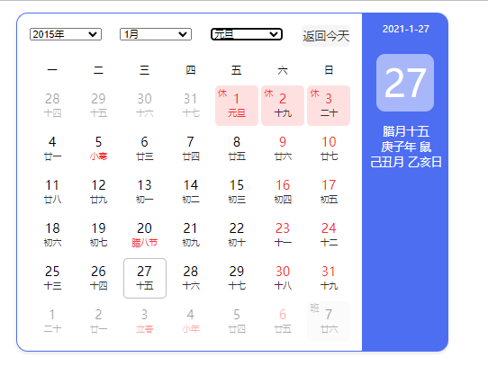

# vue-baidu-calendar-vue2
forked from [qiuquanwu/vue-baidu-calendar](https://github.com/qiuquanwu/vue-baidu-calendar)

原项目基于Vue3实现这边为了适应自己的环境，降低成vue2 并且移除antd依赖。

基于vue2实现的百度日历组件。宜忌算法尚未实现，欢迎pr。

 ## 安装

npm

```bash
$ npm install
$ npm run serve
```

yarn 

```bash
$ yarn
$ yarn serve
```


## 使用
把/src/componets/BaiduCalendar.vue和Utils直接拷贝到所需要的项目中。

HelloWorld.vue

``` html
<template>
  <div>
    <!-- 要给外层div指定合适的宽度 -->
    <div style="width: 600px; margin-top: 16px; margin-left: 16px">
      <baidu-calendar @change="change" :date="date" :range="range" />
    </div>
  </div>
</template>

<script>
import baiduCalendar from "./BaiduCalendar";
export default {
  data() {
    return {
      date: "2021-1-27",
      range: [2015,2025],
    };
  },
  components: {
    baiduCalendar,
  },
  methods: {
    change(obj) {
      console.log("obj", obj);
    },
  },
};
</script>

<style>
</style>
```
## 演示


